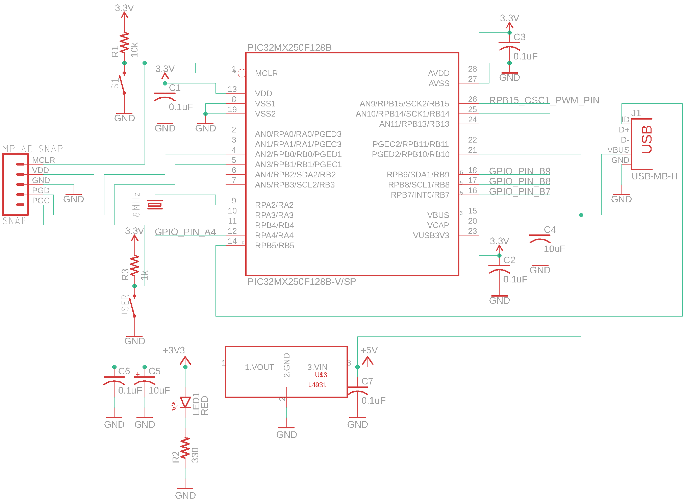
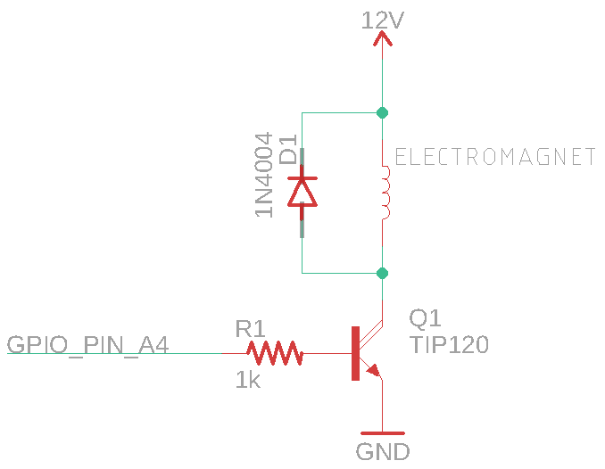
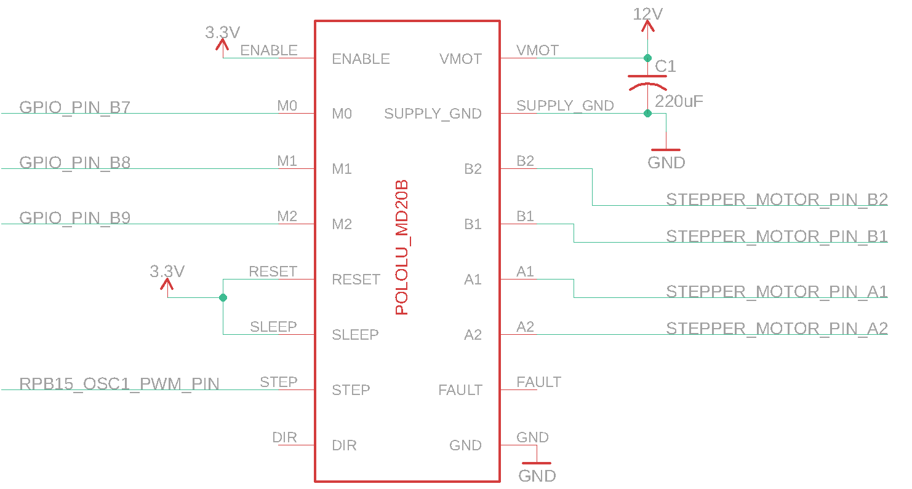

# Electrical Design

This directory holds the EAGLE `.sch` files used to develop the schematics of the electronics used in the project. It further holds images of those schematics. The electronics used are described below&#58;

## Microcontroller

The brains of the project allowing for the electromagnet to be triggered at the right time and controlling the rotation and timing of the stepper motor is a [PIC32MX250F128B](../Docs/PIC32MX1XX2XX-28-36-44-PIN-DS60001168K.pdf) microcontoller. 

The breakout schematic of this microcontroller, necessary for programming as well as interaction at a 3.3V logic level, is shown below. It includes a 3.3V voltage regulator, a <a href="https://www.pololu.com/" target="_blank">Pololu</a> breakout board of a micro-usb connector as well as a MPLAB Snap for programming.

## Electromagnet Driver

The circuitry that is used to drive the [electromagnet](../Docs/Electromagnets_McMaster-Carr.pdf) consists of a GPIO pin from the microcontroller going through a 1 kilo Ohm resistor to the base of an NPN Darlington transistor. The collector of which is connected to a 12V power supply through a parallel combination of the electromagnet being activated and a flyback diode. The emmitter of the transistor is connected to ground. This allows the GPIO pin to be used as a simple on/off switch for the electromagnet.

## Stepper Motor Driver

The circuitry used to control the stepper motor is the Pololu [MD20b](https://www.pololu.com/product/2133/resources) chip. This chip is a breakout board for the [DRV8825](../Docs/drv8825.pdf) which has two H-bridge
drivers and a microstepping indexer, along with some protective circuitry. This chip allows the stepper to be simply controlled by 3 GPIO pins to control the step resolution (M0,M1,M2) and one pin set to output a PWM signal (STEP). This chip also allows for 3.3V logic to be used from the microcontroller while supplying the motor with the 12V necesarry to use it. 

As can be seen in the [code](../Code) directory, pins M0, M1 and M2 are used to set the resolution at which the motor is controlled. Setting M0 and M1 high and M2 low sets the driver to control the motor in 1/8 step mode, meaning the 200-step-per-revolution motor now has 1600 microsteps per revolution. A PWM signal is sent to the STEP pin to drive the motor.

