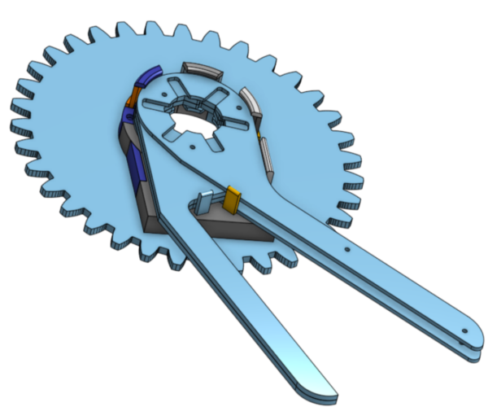

# Mechanical Design

As the most time consuming, complex and important aspect of this project, the mechanical design involves a lot of iterations. All iterations were useful in getting to the final design. However, the designs shown in this README are the ones in the `Iterations` and `Current` directories. These designs represent the designs finally used and the ones that came out of big changes to the approach.

## Initial Designs
The two initial goals of the design, deemed to be the most important in order to achieve the end goal, were to hold the wrench in place and then subsequently to be able to place a jaw in the wrench in a manner that could be repeated 6 times - for each jaw. This led to the first iterations of the design worth mentioning.  

### Outer Jig - Wrench Holder
It became clear that a way in which 6 jaws could be placed in a repetitive manner would be to hold the wrench in place around the center, wherein the jaw actuation would take place, and then rotate the wrench around this actuator. This led to the following design. The indentations around the circle are in there to allow for a jaw to be placed in any of those six spots. The raised bumps on either side of the circle are the to help fix the wrench in place.

This design was clearly not very good as it was not dimensioned well to hold the wrench at all. This design evolved into something that was built off of the wrench's actual dimensions. It included a bit more support for the bottom of the wrench.

This design finally became dimensioned to precisely hold the wrench open to a certain angle - so as to allow for the jaws to be placed within the wrench. It further includes some protection against th wrench falling out of the jig since the final design requires for the jig and wrench combination to be held at a 90 degree angle.

### Inner Jig - Jaw Placement
The jaw placement designs tell a story of the two key changes of approach that completely revolutionised how the whole project would look.

The first design for the inner jig was based off of the idea that the jaws would be fed into the system from above in a uniform manner. This meant that the jaws would have to be shifted in a translational manner between left and right so as to place the jaw in the wrench. 

As can be seen in the above design, the jaw was supposed to be caught by the "jaw placer" in the middle of the jig. This would then be actuated from below in a translational manner so as to place the jaw. 

The problem encountered with this design was that the reliability of the jaw falling in the correct orientation was low and the lack of physical space in which to actuate the "jaw placer". This led to the next idea which was to feed the jaws into the system from the bottom.

This design was based off of the same principle of using a "jaw placer" in the center of the jig to place the jaws. But this time the jaws beign fed into the jig from the bottom would push against the ramp in the housing in the middle of the jig which would in turn force the jaw out of the opening and onto the "jaw placer". Subsequently, the "jaw placer" would then be actuated from below in a translational manner so as to place the jaw.

This again saw similar problems as the "feed from the top" design as the jaw still had to fall into place and the room for actuation was not improved. 

While playing around with the 3D printed models of the design, it was noticed that holding the center jig at a 90 degree angle to the wrench allowed for the jaws in the system to simply fall into place! This revelation led to the final approach used in the project.

## Final Designs - Gravity is my Friend!

### Inner Jig
The final design idea is to have the jaws being fed laterally into the inner jig. Once in the inner jig, these jaws can then fall into the wrench if the outerjig holds the wrench in the correct spot. Below is the design for the inner jig, along with a feeding tube used to get the jaws into the jig&#58;

With this design, some key objectives in order to make it useful are to propel the jaws along the feeding tube into the inner jig, control how and when the jaws are dropped into the wrench and to keep the jaws in the correct orientation so that they can fall into place. A simple solution to solve all three of these objectives is to use an electromagnet placed at the head of the inner jig as well as a steel bar placed above the head of the inner jig that extends to the feeding tube. This bar will act as a magnet when the electromagnet is on and as such will keep the jaws oriented correctly. The recess for this steel bar can be seen in the image above. The placement of the electromagnet can be seen in the full assemnbly of the final design. 

### Rig
In order to have this design held at 90 degrees, a rig was designed. This rig was designed with two main objectives, it had to be able to support the weight of all the necessary components of the design and it had to allow for the movement necessary for the design. It can be seen below&#58;

This rig is made from 3mm thick acryllic sheets and was laser cut and assembled from 6 parts. The drawings of these cuts can be found in `.dxf` format in the `/Current/Laser_Cut_Pieces` directory. The rig has holes in the front piece, these holes are there to allow for the necessary components of the design to be screwed into the correct location.

### Gears

With the rig and inner jig in place, in order to rotate the outer jig holding the wrench around the inner jig - in order to place 6 jaws, it became clear that a gear system driven by a motor would be necessary. The gears were designed such that the driver gear could be controlled by a stepper motor and the driven gear can hold and rotate the outer jig. The gears were designed with a teetch ratio of 35/15. This was chosen to allow for easy rotation in minimal space, allowing the driver gear to be small but not require a very strong motor.

The driven gear was 3D printed so as to allow for it to be connected to the stepper motor using a sprocket with a set screw. This design is shown below, including the sprocket used&#58;

The driven gear was laser cut and designed with a hole in the middle of it, in the shape of the outer jig. The outer jig was then joined to the gear making it one part capable of rotating around the inner jig while holding onto the wrench. The driven gear with the outer jig holding a wrench can be seen below&#58;

### Clamps

Since the driven gear has to hold the wrench, this part, with the wrench in place, is heavy and could easily fall of the front of the rig. With this in mind, magnetic clamps were designed to hold the driven gear flush to the face of the rig while still allowing for full rotation of the gear. 

These are design to hold magnets on either side of the rig. This allows for the driven gear and the wrench to be easily removed for a new wrench to be placed into the system, yet it allows for the gear to rotate freely and mesh properly with the driver gear. The design is shown below, the cylindrical holes are dimensioned to hold magnets firmly in place.&#58;
 

### Actuators

In order to actuate the design as described, the electromagnet and stepper motor being used will need to be held in place.

The motor was held in place, with its shaft, at the necessary distance using a spacer screwed into both the front of the rig as well as the actual motor. This [spacer](Current/3D_Prints/motor_spacer.stl) was 3D printed.  

Further, the electromagnet needs to be held at the head of the inner jig. This holder was made of two 3D printed parts, [elecmag_holder1](Current/3D_Prints/elecmag_holder1.stl) and [elecmag_holder2](Current/3D_Prints/elecmag_holder2.stl). This was designed to be ble to hold the heavy electromagnet in place while allowing for the full rotation of the wrench. 

