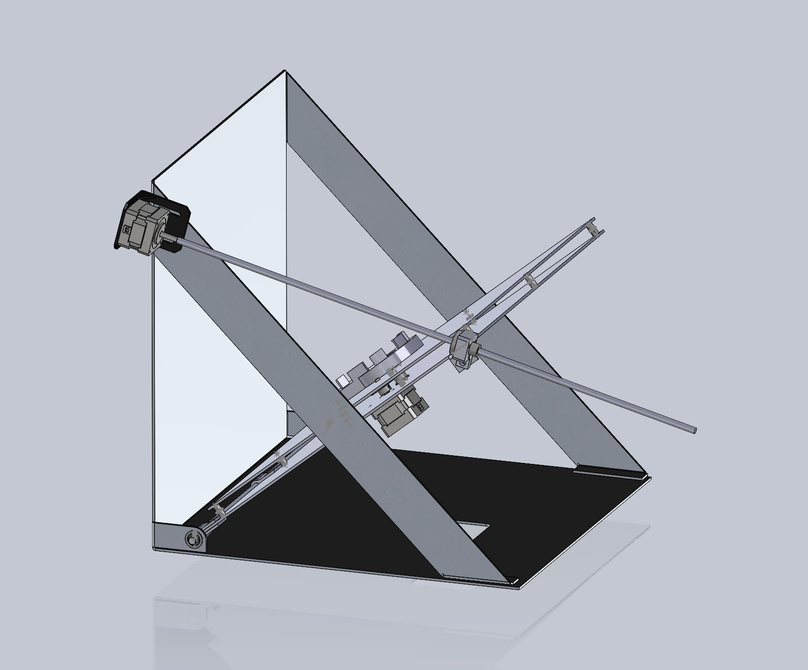

# Mechanical Design
The mechanical design part of this project was by far the hardest part. Many of the parts designed has complex geometries that required 11 hour + 3D print jobs per part. Because of this, a lot of analysis was done between part iterations to reduce "downtime" where I could not further refine the design. Although only a few key design iterations will be shown in this document, many smaller iterations took place on each part to enusre that the process ran smoothly and efficiently. 

## Initial Designs
Because I was continuing work on another students' project, there were intial designs available for me to work off of. Right off the bat, I noticed two main areas of Levi's design that I wanted to improve upon and Professor Brown gave me one addition to make to the process as well. These three changes/additions became the backbone of my project and were:

- Overall Structure
- Feeding Mechanism
- Jaw Orientation.

## Design Refinements
### Overall Structure
At the start of the project I identified the structure as one of the main components that both wouldnt hold up to a manufacturing environment and could use some refinement to improve usability. Mainly, the old design was a little too flimsy (it was a prototype so this makes sense). To fix this issue, I came up with a new sheet metal pattern that I was able to cut out of aluminum using a waterjet and bend using a brake. It had relatively similar geometry to Levi's initial prototype, but the wrench would be placed on the inside, rather than the outside and the structure as a whole was bigger than the initial. Below is the new design, followed by a wrench holder mechanism further discussed below.

  
   

The new structure also has an important addition for usability. There is a middle panel that swings 90 degress from flat to vertical, allowing for easier wrench placement. The user can place the wrench in easily when it's in a horizontal mode and then the whole panel can be lifted up to interface with the jaw placement mechanism. Initially, this could be done using a stepper motor and lead screw, but ultimately it was decided that the user would be perfectly capable of doing this motion by hand so that was removed.

  

Embedded in this platform is the mechanism that rotates the wrench 60 degrees for each different jaw. This system is geared 2:1 so it has the required torque to rotate the wrench against gravity in its vertical position. 

### Feeding Mechanism
The jaw feeding mechanism was the second design refinement I chose to tackle. Levi's design used an electromagnet to pull jaws one by one through a 3D printed tube, and then cut off power to the electromagnet allowing the jaw to fall into place in the wrench. I ultimately discovered that the electromagnet was too unreliable to continue to be used. It ended up being a passive drive to get the jaws into position so that they could be attracted by the electromagnet as well. 

I tried using the electromagnet in an initial design and found that it wasn't strong enough to reliably pull jaws to the correct positon. I tried different electromagnets as well and even tried building my own to the specs I wanted, but none worked reliably. 

I decided that I wanted a driven mechanism for getting the jaws into position, and that I wanted to rely less on the electromagnet. My inital design for this iteration was a feeder wheel driven by a continuous servo on the top of the jaws that would use friction to push the jaws through, and a "droprod" on the botton that could be pulled back by a second regular servo. The drop rod part of this iteration worked really well, but the feeder wheel had many issues. As the jaws went under the wheel, one edge would tweak up, causing the chute to become jammed and not let any other jaws through. I made a few different iterations of this design with tighter tolerances to try and prevent this behavior, but it just didn't end up working right.

For the final major design iteration on the feeding mechanism I realized that the wrench jaws were almost the same size and shape as a pez. I used a pez dispenser as inspiration and created a magazine style feeding mechanism that used a rod driven by a servo to push evenly on the whole back side of the jaw. This prevented any of the tweaking motion that jammed up the previous design. It also reduced the number of servos required by one. 

  
   
   

Left to Right - Electromagnet Design, Feeder Wheel Design, Magazine Design

### Jaw Orientation
This objective was given to me by Professor Brown, with the goal of being able to dump jaws into a bowl descrambler and have them load directly into the jaw feeder in the correct orientation. A bowl descrambler vibrates enough to drive jaws up a ramp and they get knocked off at different points along the way if they arent in the correct orientation. For this part of the project, I spent a good deal of time getting familiar with the technology by placing cardboard and metal knockoff pieces using tape. 

Eventually I understood enough about what would knock the pieces off to 3D print a design to attempt it. After a few revisions of this part, I was able to get the pieces consitently coming out of the machine in the correct orientation, running along a rail.

The next step was to design a was for them to drop off the rail I had them running along into the vertical "pez dispenser" chute. This also took a few design iterations but eventually I ended up with this part, which interfaces at the end of the path on the bowl descrambler and at the top of the pez dispenser tube.

    
  

The angled wall knocks off all pieces that arent in a vertical orientation, and the sloped rail forces pieces that arent in the correct vertical orientation into a horizontal one, which causes them to get knocked off by the angled wall. The second longer wall with a slope at the end directs the pieces into the correct position to get picked up by the sloped rail. At the end, the box looking section is a funnel that funnels the pieces into a vertical magazine tube.

## Other components

### Actuators
A second stepper motor and drive board were added to drive the leadscrew and pull the platform to vertical, but those were since removed because it was decided to be unnecessary. A servo was also added that drives the rack for the magazine feeder design. 

### Electromagnet
An electromagnet is still used to hold the jaws in places as the platform is lowered to its horizontal position. Without the electromagnet, the jaws at the top of the wrench would fall out due to gravity on the way down. The electromagnet is embedded in the 3D printed wrench holder and is constantly on (run at 12V). 

