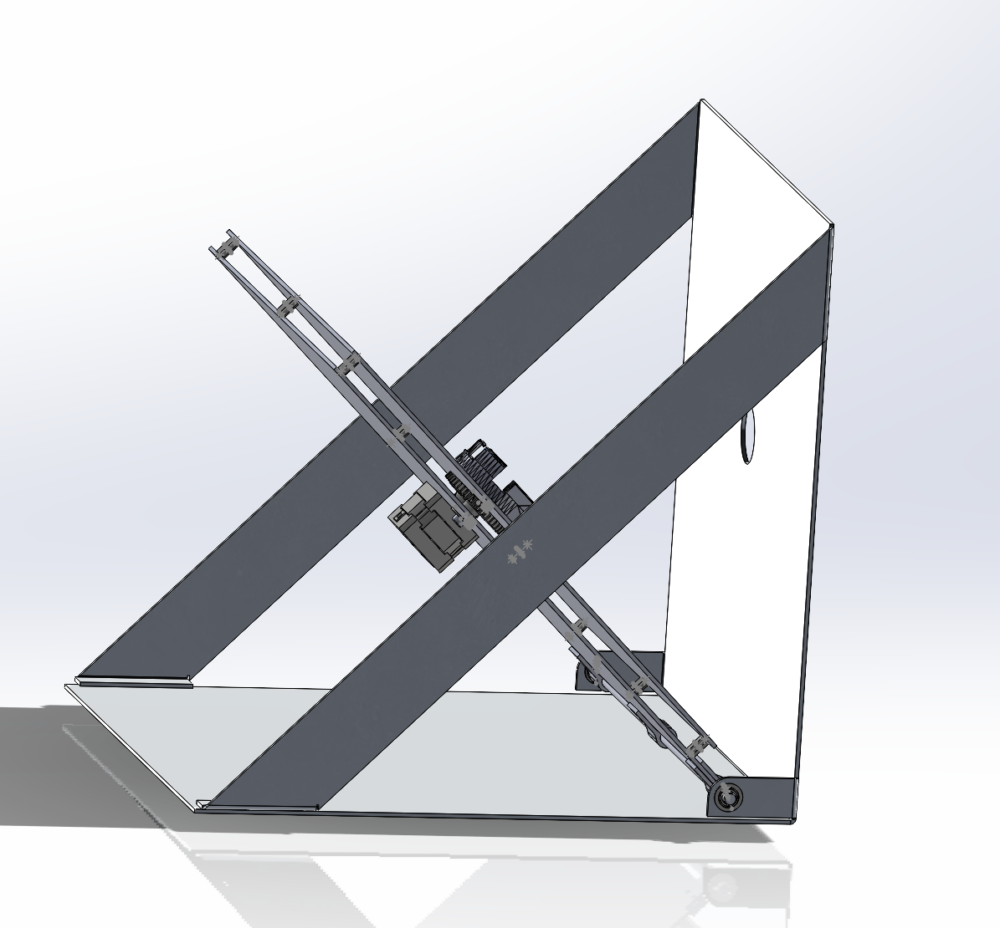

# LoggerHead Tools Bionic Wrench Manufacturing Automation
This is the repository for my final project in the MSR (Masters of Science in Robotics) program at Northwestern University. The project was to automate the production of the LoggerHead Tools Bionic Wrench.

## Overview

The goal for this project was to continue to evolve the design created by Levi Todes (MSR '18) and add usability features like a magazine to store wrench jaws, a bowl descrambler to orient wrench jaws, and a movable platform for easy wrench placement. 

There were three main components to this project, the structure which was made out of sheet metal, the magazine which was 3D printed and the bowl descrambler ramp which was also 3D printed. Each one of these parts went through many iterations along the design process. All of the parts were designed using SolidWorks and most were printed on the Ultimaker 3.

A PIC32MX250F128B was used to control the system, along with a DRV8834 stepper controller from pololu (for stepper motor control). The MPLab SNAP was used as the programmer and the code was in C. 

- Insert Video

## Approach
Going into this project I knew there were three main areas that I wanted to target -- The wrench placement, jaw orientation process and jaw feeding process. 

The wrench placement process in the previous design required the user to take off a drive gear, place the wrench in a 3D printed holder and then reattatch the gear to the assembly using some magnetic latches as shown below.

My new mechanism uses a hinge to allow the wrench to be placed on in a horizontal orientation and then moved into a vertical orientation by just flipping the whole mechanism up. This can be done with a stepper motor and lead screw, but ultimately it was decided that its easy enough to do by hand. 

For the jaw orientation process, there was not really any work already completed. For this I first used pieces of cardboard, metal and tape to try and knock the pieces off of the ramp that were in the wrong orientations. After getting an understanding of how to orient the pieces, I created a few 3D printed designs and tested them out until one worked. I then refined that design a few more times until the pieces would consistently drop in the correct orientation out of the bottom of the descrambler.

For the jaw feeding process I started by modifying Levi's electromagnet technique, which would use an electromagnet to pull the jaw into position and then shut it off, allowing the jaw to succumb to gravity and fall into place. Unfortunately, I found this method to be unreliable, so I switched to a more mechanical design. This second big design iteration used a rod on the bottom and a feeding mechanism on top to feed the pieces through a track and also control when they were allowed to fall out as well. The main issue with this design was that despite numerous design iterations, I couldn't get the pieces to feed without catching on the track walls and jamming up the system. For the final big design iteration, I decided to switch to a magazine type feeder that uses a vertical tube and a pushrod to feed out the pieces like a pez dispenser. This method worked far better than the others and allowed for easy integration with the bowl descrambler through a vertical tube.

## Mechanical Design
The mechanical design involved in this project was by far the most important, most complex and thus the most time consuming aspect of the project. As is the nature of design, it involved a lot of iterations as well as a few changes in approach that ultimately led to the final design. This final set up is shown below.

For more detailed descriptions of the mechanical design process please visit the [Mechanical Design Directory](/Mechanical_Design).

## Electronics

[This](/Electronics) directory contains the <a href="https://www.autodesk.com/products/eagle/overview" target="_blank">EAGLE CAD</a> files used to develop the schematics of the circuitry used in this project. It further contains a README explaining the circuitry used.

## Code

The C code used to program the microcontroller is in [this](/Code). directory.

<!-- ## Future Work -->
