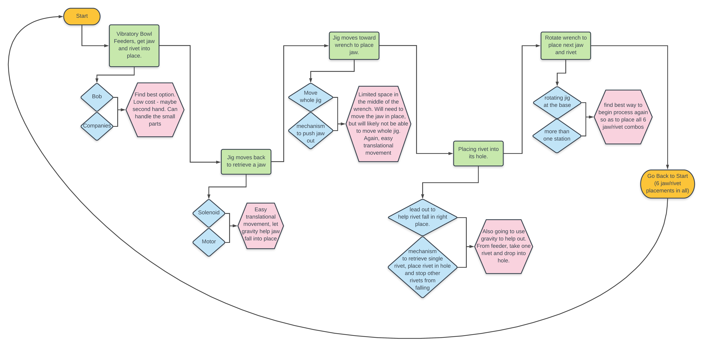

# Part_Placement_Automation_Project
This repository contains the details of my final project for my Masters in Robotics at Northwestern Univeristy. This project entailed the automation of a part of the production process for a specific Wrench and was supervised by Professor Dan Brown.

## Overview
The initial goal of this project was to observe the manufacturing process of the wrench and identify a bottleneck in the process that can be addressed by automation. With that goal set out, there were no set requirements on what should be automated and how it should be automated. This allowed for freedom and trust in following the design process to achieve the optimal solution to this problem.

After journey mapping the manufacturing process, giving time values for each task as well as automatibility ratings and assessments regarding what would be gained from automation, it was clear to see that the set of tasks involved in placing the wrench jaws in the wrench are both the most automatable and automating them will result in the most gain to the entire process. As such the task was set out to use/design whatever is deemed appropriate to automate this process in a way that is both accurate and fast.

The result is shown in the video below:

As will be detailed, the mechanical design for this project was primarily done using <a href="https://www.onshape.com/" target="_blank">OnShape</a> CAD software, the construction of the rig was done using various prototyping methods such as 3D printing and Laser Cutting, a PIC32MX795F512H microcontroller was used to control the system and the relevant peripheral circuitry and coding of the microcontroller was done in C. 

## Approach
As mentioned above, the first step of this project was just to observe. Professor Brown gave me videos of the current production process for the wrench and I began to make note of each task being undertaken, how long each task was taking and how that task affects the other tasks. It was clear that the biggest bottleneck in the process was the placing of the wrench jaws in the wrench. This task represented the biggest gain from automation but also perhaps one of the most challenging steps to automate given the precise needs for placing the jaw as well as the small amount of space in the middle of the wrench in which a mechanism can actuate.

So begun the iterative process of design. The bulk of work done in this project was in mechanical design, each week brought about a new iteration of the current design as well as thoughts on a new approach. That journey can be mapped by following the different "STL" files of the various designs that were cycled through before arriving at the final stop. 

It became important to create journey maps of best case scenarios, so as to assess the approach and figure out what could be done in time as well as what could be done better.
<!--  -->

A big change in the approach came about when it was decided that using gravity to place the jaws could simplify the process by eliminating the need to actuate within the small space in the middle of the wrench. This came about as a serendipitous thought during a brainstorming session with Professor Brown. 
As such, the final approach was to use gravity to place the jaws in the wrench, with the assistance of an electromagnet and to rotate the wrench around the jig and repeat - so as to place all 6 jaws. This is further detailed in the READMEs of each directory.

## Mechanical Design
The mechanical design involved in this project was by far the most important, most complex and thus the most time consuming aspect of the project. As is the nature of design, it involved a lot of iterations as well as a few changes in approach that ultimately led to the final design. This final set up is shown below.

The design process is discussed further in the [Mechanical Design Directory](/Mechanical_Design).

## Electronics

[This](/Electronics) directory contains the <a href="https://www.autodesk.com/products/eagle/overview" target="_blank">EAGLE CAD</a> files used to develop the schematics of the circuitry used in this project. It further contains a README explaining the circuitry used.

## Code

The C code used to program the microcontroller is in [this](/Code). directory.

<!-- ## Future Work -->
